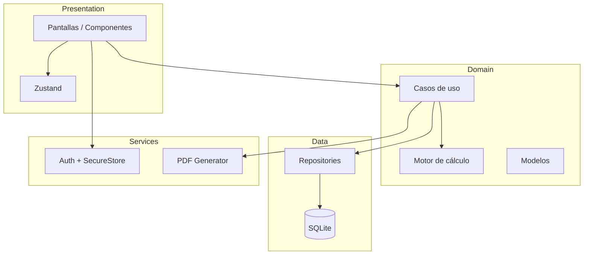

# Fase 2 — Arquitectura y estructura

## Stack (MVP)

| Capa | Tecnología |
|------|------------|
| UI móvil | React Native + Expo (SDK estable LTS) |
| Lenguaje | TypeScript estricto |
| Navegación | Expo Router o React Navigation (file-based con Expo Router recomendado) |
| Formularios | React Hook Form + Zod |
| Estado UI/global ligero | Zustand |
| Persistencia | expo-sqlite |
| Sesión segura | expo-secure-store |
| PDF | expo-print + expo-sharing (HTML → PDF) o react-native-html-to-pdf |
| Tests | Jest (cálculo puro), opcional Maestro/Detox después |

**Por qué Expo:** build APK privado (EAS o prebuild local), buen soporte SQLite y Secure Store, un solo codebase TypeScript, fácil de testear lógica fuera de UI.

---

## Principios

1. **Motor de cálculo puro** en `domain/` — sin React, sin SQLite.
2. **UI solo orquesta** — no fórmulas en componentes.
3. **Configuración en datos** — rangos maquila, tipos MAT, defaults en DB seed + pantalla admin.
4. **Offline-first** — ningún servicio requiere red en MVP.
5. **Testabilidad** — cada función de dominio con tests unitarios y casos del Excel.

---

## Estructura de carpetas propuesta

```
valorizacion-minera/
├── app/                          # Expo Router — pantallas
│   ├── (auth)/
│   │   └── login.tsx
│   ├── (tabs)/
│   │   ├── index.tsx             # Nueva valorización
│   │   ├── historial.tsx
│   │   └── configuracion.tsx
│   └── valorizacion/
│       ├── [id].tsx              # Detalle / edición
│       └── nuevo.tsx
├── src/
│   ├── domain/
│   │   ├── calculation/          # Motor puro
│   │   │   ├── tms.ts
│   │   │   ├── grade-conversion.ts
│   │   │   ├── maquila-suggestion.ts
│   │   │   ├── valuation-gold.ts
│   │   │   ├── valuation-silver.ts
│   │   │   ├── valuation-total.ts
│   │   │   └── index.ts
│   │   ├── models/               # Tipos de dominio (sin ORM)
│   │   ├── validation/           # Reglas Zod compartidas
│   │   └── services/             # Casos de uso (orquestación pura)
│   │       ├── create-valuation.ts
│   │       ├── compare-scenarios.ts
│   │       └── generate-code.ts
│   ├── data/
│   │   ├── db/
│   │   │   ├── schema.ts
│   │   │   ├── migrations.ts
│   │   │   └── client.ts
│   │   ├── repositories/
│   │   │   ├── valuation-repository.ts
│   │   │   ├── config-repository.ts
│   │   │   └── user-repository.ts
│   │   └── mappers/              # DB row ↔ domain
│   ├── presentation/
│   │   ├── components/
│   │   ├── hooks/
│   │   └── stores/               # Zustand
│   ├── services/
│   │   ├── auth/
│   │   ├── pdf/
│   │   └── export/
│   └── utils/
│       ├── rounding.ts
│       ├── dates.ts
│       └── ids.ts
├── assets/
├── docs/
├── __tests__/
│   └── domain/
│       └── calculation/
├── app.json
├── package.json
└── tsconfig.json
```

---

## Capas y responsabilidades



---

## Motor de cálculo (diseño)

```typescript
// Entrada normalizada (dominio)
interface CalculationInput {
  tmh: number;
  h2oPercent: number;
  goldGradeOzTc: number;
  silverGradeOzTc: number;
  recPercent: number;
  scenario: ScenarioParams;
}

interface ScenarioParams {
  maquila: number;
  consumos: number;
  flete: number;
  rcGold: number;
  rcSilver: number;
  interGold: number;
  interSilver: number;
  factor: number;
  otrosCostos?: number;
}

// Salida
interface CalculationResult {
  tms: number;
  valorAuPerTms: number;
  valorAgPerTms: number;
  valorFinalPerTms: number;
  valorTotal: number;
}
```

- Funciones pequeñas y composables.
- `suggestMaquila(leyOzTc, ranges[])` separado de valorización.
- Escenarios: misma `CalculationInput` base, distinto `ScenarioParams`.

---

## Persistencia (SQLite)

Tablas principales (borrador — detalle en Fase 3):

- `users`, `sessions`, `devices`
- `material_types`, `maquila_ranges`, `providers`, `provider_defaults`
- `valuations`, `valuation_scenarios`, `valuation_inputs`
- `app_settings` (factor global, etc.)

---

## PDF

- Plantilla HTML en `src/services/pdf/templates/valuation-report.html`
- Datos inyectados desde caso de uso `exportValuationPdf(id)`.
- Incluye: logo, código, fecha, tabla inputs, resultados, bloque 3 escenarios.

---

## Seguridad (MVP)

| Requisito | Enfoque |
|-----------|---------|
| No contraseñas en claro | bcrypt o argon2 en JS (expo-crypto + lib) / hash en registro |
| Sesión | token en SecureStore + expiry |
| Bloqueo usuario | flag `is_active` en `users` |
| Expiración dispositivo | `devices.valid_until` |
| Roles | `role` enum en JWT local o sesión |

---

## Entregables por fase (siguiente trabajo)

| Fase | Entregable |
|------|------------|
| 3 | `docs/03-MODELOS-DE-DATOS.md` + tipos TypeScript |
| 4 | Motor + tests con casos del Excel |
| 5 | Pantallas base (sin PDF) |
| 6 | SQLite + historial |
| 7 | PDF |
| 8 | Login + roles |
| 9 | Cobertura tests |

---

## Nombre del paquete

- Carpeta: `valorizacion-minera`
- Slug Expo: `valorizacion-minera`
- Nombre visible: **Valorización Minera** (configurable)
